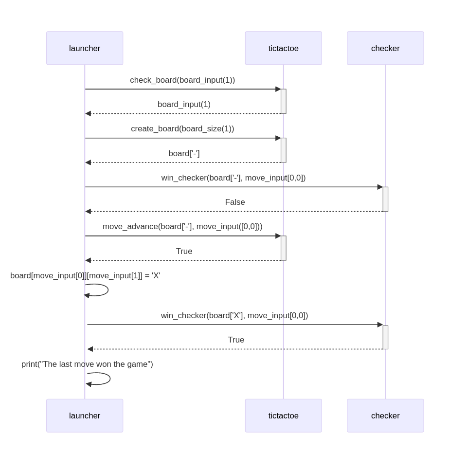

# Arkkitehtuurikuvaus

## Rakenne
Viikon 5 vaiheen kuvaus ohjelman rakenteesta. launcher.py kysyy käyttäjän toimenpiteitä ja säilyttää varsinaista pelitilaa, tictactoe.py muokkaa launcher.py:n antamia syötteitä ja tekee niille tarkistuksia. checker.py ilmoittaa, kun voittava siirto on tehty.

## Sekvenssikaavio

Esimerkkitilanne pelin kulusta:
- Pelaaja valitsee 1x1 pelin
- check_board tarkistaa laudan sopivuuden ja palauttaa laudan koon (1)
- create_board luo ja palauttaa laudan (listojen lista) "-" -merkein. Tässä tapauksessa vain ["-"]
- win_checker tarkistaa, onko pelillä voittajaa (False)
- X:n pelaaja pelaa siirroon koordinaattiin 0,0 ja move_advance hyväksyy siirron (True)
- Siirto päivitetään peliin
- win_checker tarkistaa, onko pelillä voittajaa (True)
- Voittaja löytyy ja edellisen siirron ilmoitetaan voittaneen
