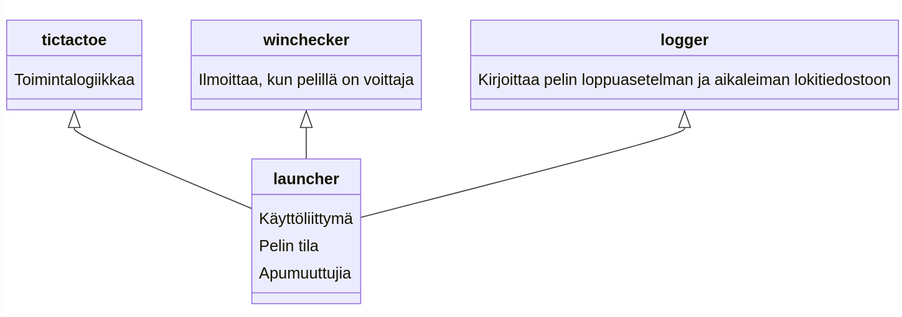

# Arkkitehtuurikuvaus

## Rakenne
Viikon 4 vaiheen kuvaus ohjelman rakenteesta. launcher.py kysyy käyttäjän toimenpiteitä ja säilyttää varsinaista pelitilaa, tictactoe.py muokkaa launcher.py:n antamia syötteitä ja tekee niille tarkistuksia.

