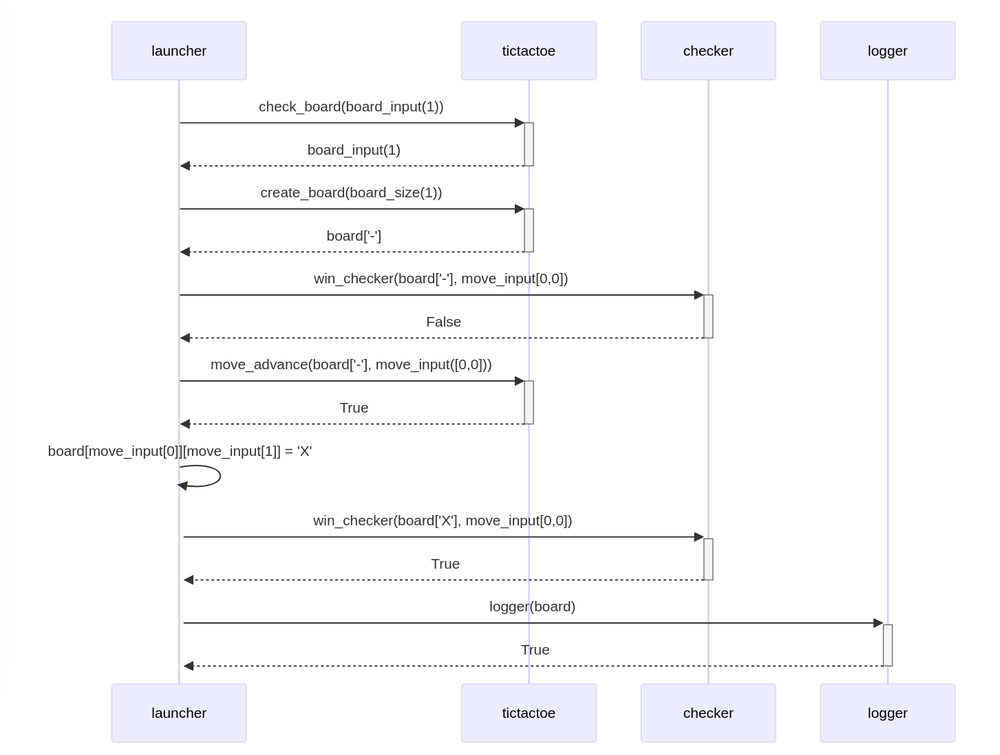

# Arkkitehtuurikuvaus

## Perusrakenne
Loppupalautuksen mukainen kuvaus ohjelman rakenteesta. launcher.py kysyy käyttäjän toimenpiteitä ja säilyttää varsinaista pelitilaa, tictactoe.py muokkaa launcher.py:n antamia syötteitä ja tekee niille tarkistuksia. winchecker.py ilmoittaa, kun voittava siirto on tehty. logger.py tallentaa pelin lopputilan ja aikaleiman haluttaessa lokitiedostoon.

## Sekvenssikaavio

Esimerkkitilanne pelin kulusta (1x1 peli ei lopullisessa versiossa oikeasti sallittu, minimi 3x3):
- Pelaaja valitsee 1x1 pelin
- check_board tarkistaa laudan sopivuuden ja palauttaa laudan koon (1)
- create_board luo ja palauttaa laudan (listojen lista) "-" -merkein. Tässä tapauksessa vain ["-"]
- win_checker tarkistaa, onko pelillä voittajaa (False)
- X:n pelaaja pelaa siirron koordinaattiin 0,0 ja move_advance hyväksyy siirron (True)
- Siirto päivitetään peliin
- win_checker tarkistaa, onko pelillä voittajaa (True)
- Voittaja löytyy ja edellisen siirron ilmoitetaan voittaneen
- launcher kysyy, haluaako pelaaja tallentaa pelin lopputilanteen lokitiedostoon. Jos kyllä, laudan lopputilanne lähetetään loggerille, ja se tallentaa pelitilan ja aikaleiman tekstitiedostoon
- Viimeinen True return on olemassa testausta varten eikä enää vaikuta peliin.

## Kokonaisuudessaan luokkien tehtävänjako on seuraava
### Launcher
- Kaikki kyselyt pelaajalta (laudan koko, siirron rivi, siirron sarake, pelin keskeytys, pelilokiin tallennus)
- Varsinainen while-loop, jossa peli pyörii
### Tictactoe
- Syötetyn pelilaudan koon tarkistus
- Tyhjän laudan generointi
- Siirron laillisuuden tarkistus
### WinChecker
- Voittajan määrittäminen (rivi, sarake, diagonaalit)
### Logger
- Pelilokin kirjoittaminen

Launcher tekee suurimman osan tulostuksista. Osa virheilmoituksista oli luonteva toteuttaa Tictactoe:n puolella, mutta ne saisi periaatteessa monimutkaisempien return-lauseiden avulla myös täysin käyttöliittymän puolelle.
