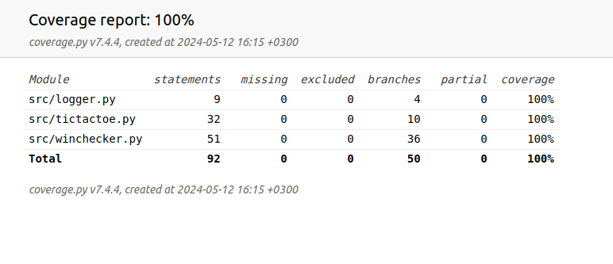
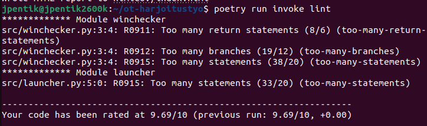

# Ohjelman testaus

## Yleistä
Sovellusta on testattu staattisen analyysin työkalu pylint:lla, yksikkötestauksella ja manuaalisesti. Sovelluksen luonteesta johtuen pääpaino on ollut toimintalogiikan toteutuksen toimivuudessa (sallitut siirrot, voittajan määrittäminen) sekä käyttäjän aiheuttamissa virhetilanteissa (vääränlaiset syötteet). Tekstipohjainen käyttöliittymä on jätetty testien ulkopuolelle. Muuten haaraumakattavuus on 100 %.

## Tiedostetut pylint-virheilmoitukset loppupalautuksen yhteydessä
- Listojen listaan viittaaminen indekseillä (unsubscriptable-object, ohitettu koodissa). Tästä ei aiheutunut käytännön ongelmia, koska listat ovat sovelluksen itsensä generoimia ja voivat sisältää vain yksittäisiä merkkejä. Nettiohjauksessa ei löytynyt tähän kiertotietä.
- Liikaa lauseita, haarautumisia ja return-lauseita voittajan määrityksessä. Tarkistuksia ei voi juuri yksinkertaistaa ja toisaalta tehtävän pilkkominen useaan luokkaan lisäisi toisteisuutta
- Liikaa lauseita käyttöliittymässä. Logiikka ei juuri yksinkertaistettavissa taikka mielekkäästi jaettavissa.

